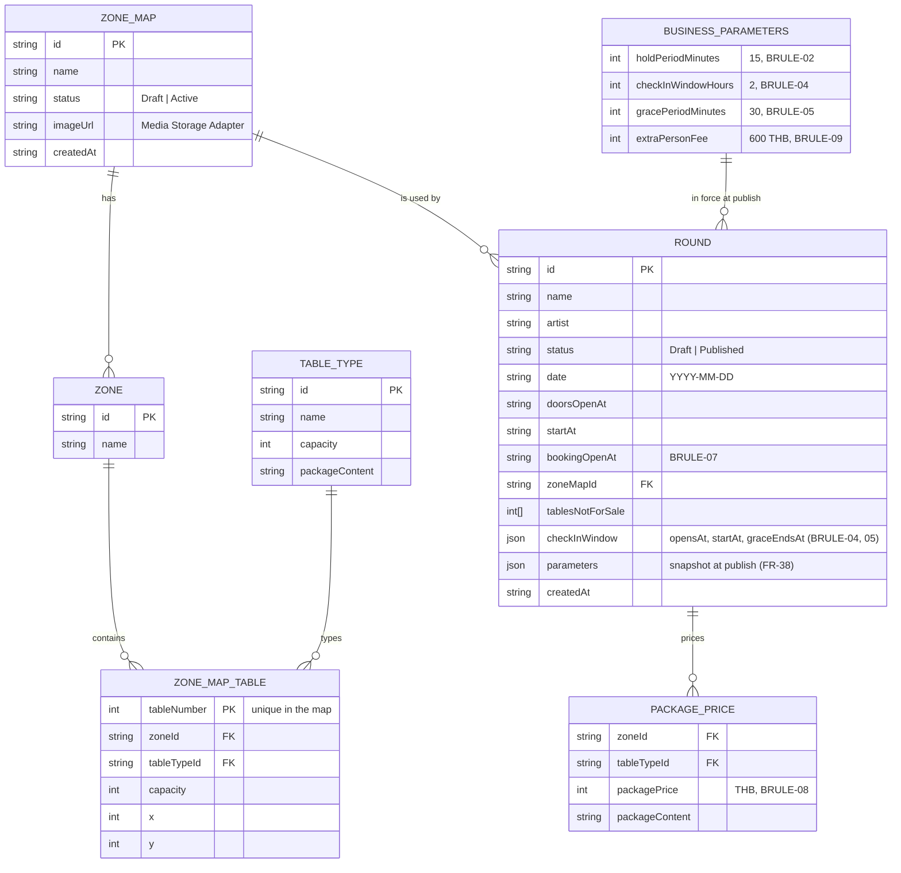
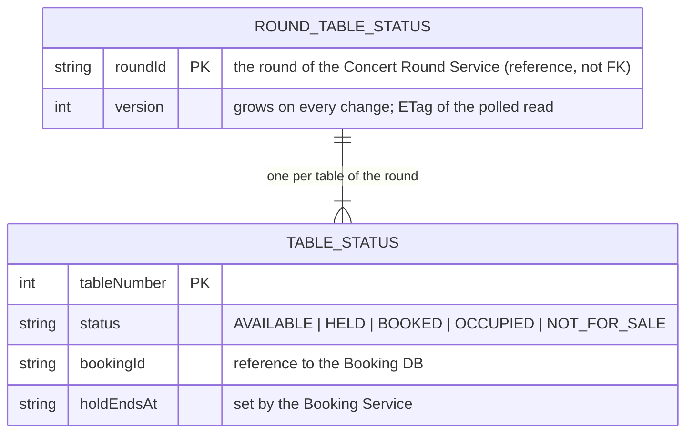
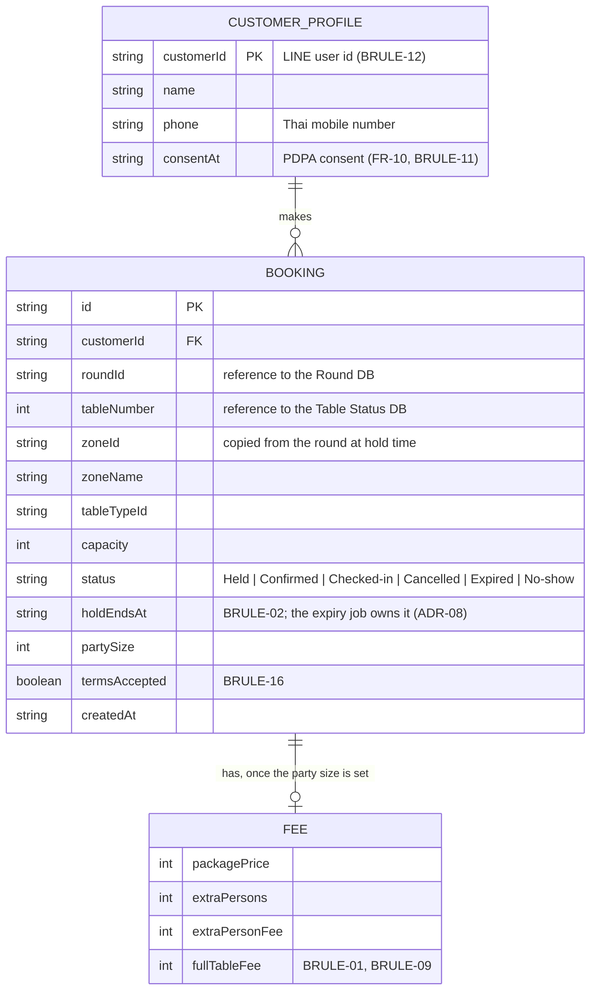
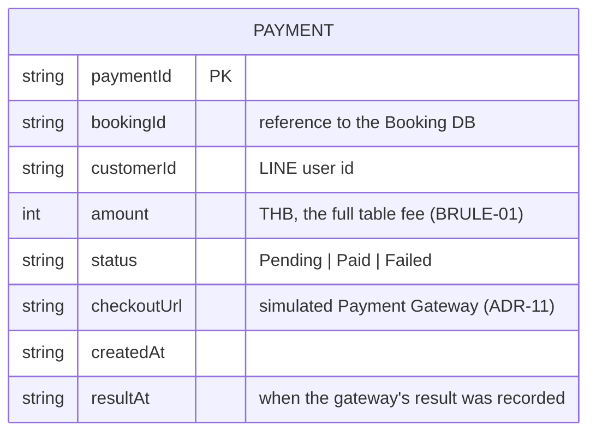
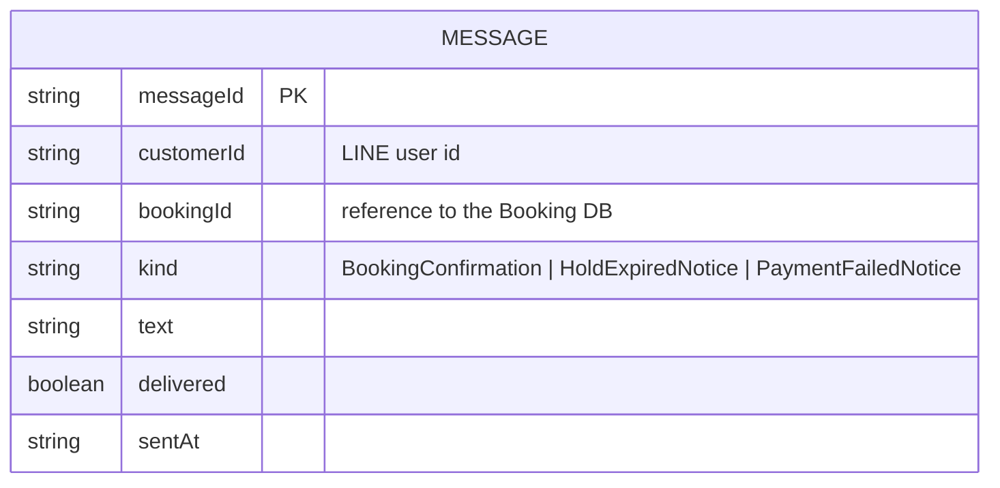
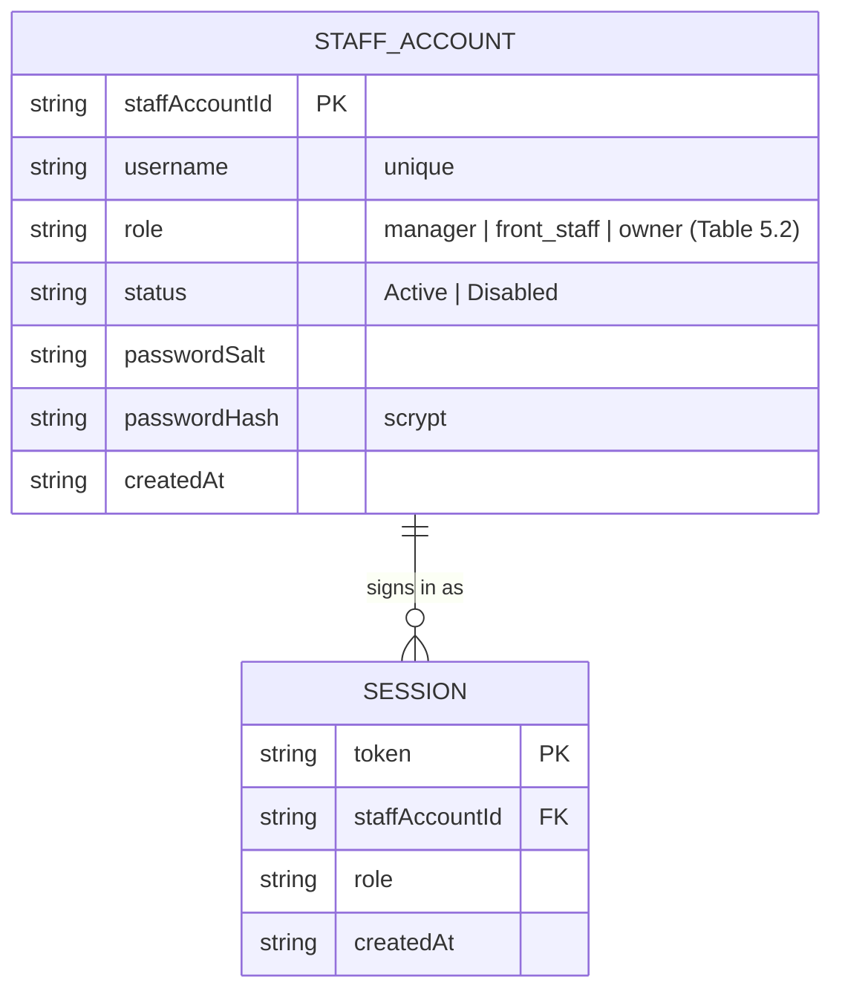

# Data model

One database per service (ADR-06, Figure 5.1), so one diagram per service. A service never reads another service's
database: a `roundId` in the Booking DB is a reference by identifier, not a foreign key, and what a service needs
from another it asks by gRPC. The diagrams are the source of the types; the chain is

```
ER diagram (this file)  ->  src/domain/model.ts of the service  the entities as TypeScript types, used by the rules and the repositories
                        ->  proto/*.proto messages          the projection that crosses services (only what a caller needs)
                        ->  gateway routes (contracts.md)   the same messages as JSON, one route per method (parameters snapshot, version, …)
```

Change the diagram first, then `model.ts`, then the `.proto` (and `npm run proto`), then `contracts.md`.

## Concert Round Service — Round DB (owner: Natchy)



Stored as documents: a zone map is one document with its zones and tables embedded (ADR-06); a round embeds its prices,
its check-in window and the snapshot of the parameters. What crosses to other services: `Round` (with the tables of its
map, joined for the caller), `RoundPricing`, `CheckInWindow` (`proto/concert_round.proto`).

## Table Availability Service — Table Status DB (owner: Will)



One document per round with its tables embedded: the read model of the table map (ADR-13). The Booking Service wins
the hold in its own database and then reports each transition here; `holdTable()` is one conditional update of the
document. The gRPC messages are this model one to one.

## Booking Service — Booking DB (owner: Peat SE)



The booking is the source of truth of the hold (ADR-13): a unique partial index on (`roundId`, `tableNumber`) where the
status is active (Held, Confirmed, Checked-in) lets exactly one insert win (BRULE-03), and `history` records every
transition. The booking copies zone, table type and capacity from the round when the table is held, so that the fee and
the ticket do not change if the map is edited later (BRULE-07). Progress 2 adds the e-ticket (signed booking reference), the
payment reference and the check-in record (time, staff account) to `BOOKING`.

## Payment Service — Payment DB



One document per payment request; the result is recorded once (a duplicate callback is ignored).

## Notification Service — Notification DB



## Staff Account Service — Staff Account DB



Sessions live in the Staff Account DB next to the accounts, in memory unless the service is configured for MongoDB (ADR-06, ADR-07); disabling an account ends its sessions.

## Not modelled yet

The message broker, service discovery and a relational database next to MongoDB are open decisions (KI-14 of the
project document); the check-in record and the e-ticket fields of `BOOKING` come with progress 2.
